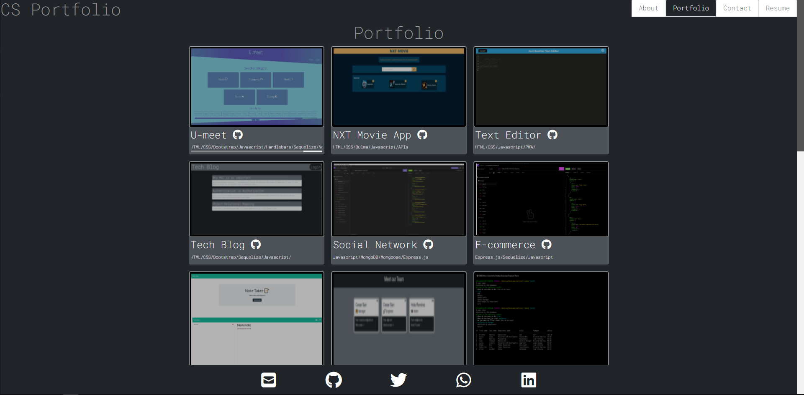

# React Portfolio 

  ## Description
  
  
This Portfolio is a single page application made with React. It integrates the use of forms, props, conditional rendering and event handling. As my Portfolio, it includes complete web applications and exercises created during the learning process. This app doesn't have a back-end, but it will be added in the future.

  
  ## Table of Contents
  
  - [Installation](#installation)
  - [Usage](#usage)
  - [License](#license)
  - [Contributing](#license)
  - [Tests](#license)
  - [Questions](#license)
  
  ## Installation
  
  
-Download repository. -Install dependencies. -Run.

  
  ## Usage
  
  
Enter the project in this [link](https://csancheze.github.io/React-Portfolio/)

  
  

  
  ## License
  
  
Copyright (c) 2022, Cesar Sanchez All rights reserved.
Licensed under the MIT license. 

  
  
[License](./MIT_license.txt)

  
  ## How to Contribute
  
  
Add back-end functionality.

  
  ## Tests
  
  
Follow the installation instructions or the see the Usage Information

  
  ## Questions
  
  If you have any question feel free to check my Github 
  
Username:csancheze
  
[Github](https://github.com/csancheze)

  or send me and email
  
<cesanchezesc@gmail.com>

